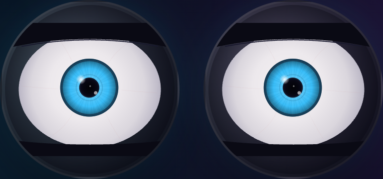
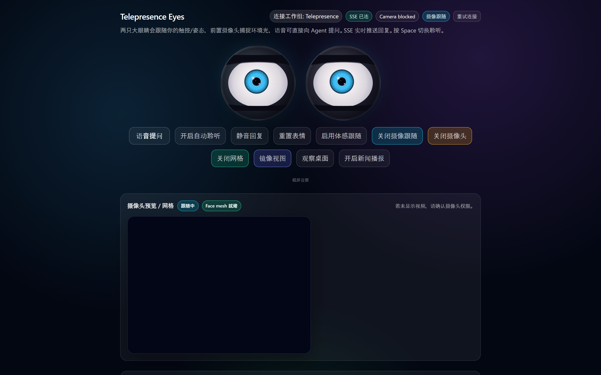
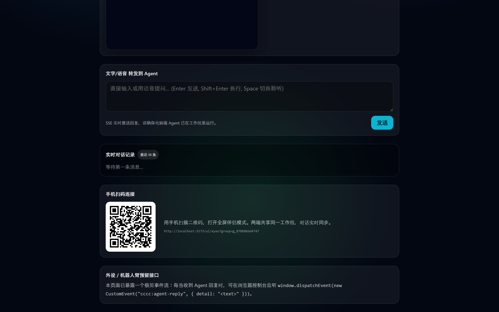
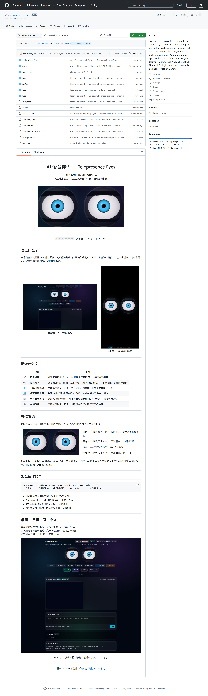
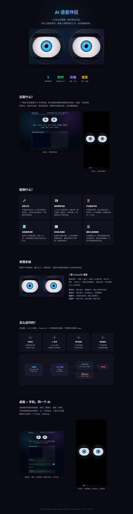

# AI 音声コンパニオン - Telepresence Eyes

[中文](README.md) | **日本語**

会話できる「動く目」の AI コンパニオン。  
デスクトップとスマホを連携し、音声対話・視線追従・画面観察・ニュース読み上げを行います。



## プロジェクト概要

本プロジェクトは `CCCC` マルチエージェント基盤の上で動く、ブラウザ向け AI コンパニオン UI です。

- デスクトップ: 音声、カメラ、ニュース、画面観察をまとめたフルコンソール
- スマホ: 全画面のシンプルなコンパニオンモード
- 同一ワーキンググループ: デスクトップとスマホで会話コンテキストを共有

## 主な機能

- 音声対話: ブラウザ音声認識 + TTS 読み上げ
- 目のアニメーション: Canvas2D で虹彩・瞳孔・瞬き・感情状態をリアルタイム描画
- 顔追従: カメラ入力に合わせて視線を追従
- 画面観察: 定期スクリーンショットを AI が解析
- ニュース読み上げ: 関心トピックを定期収集して要約を音声で再生

## UI プレビュー






## 動作要件

- Python `3.11`（最低 `3.9`）
- Node.js `18+`（推奨 `20+`）
- npm `9+`
- Windows / macOS / Linux
- ブラウザのマイク・カメラ権限

## クイックスタート（Windows）

1. リポジトリを取得

```powershell
git clone https://github.com/zixuniaowu/cccc.git
cd cccc
```

2. バックエンド依存をインストール

```powershell
uv venv -p 3.11 .venv
uv pip install -e .
```

3. フロントエンド依存をインストール

```powershell
cd web
npm install
cd ..
```

4. フロントエンドをビルド（Python パッケージへ配置）

```powershell
cd web
npm run build
cd ..
```

5. サービスを起動

```powershell
.venv\Scripts\python -m cccc.cli
```

6. ブラウザで開く

- Web UI: `http://127.0.0.1:8848/ui/`

## ワンコマンド起動

ルートの `start.ps1` を利用できます。

```powershell
./start.ps1 -LocalHome
```

仮想環境の準備から daemon + web 起動まで実行します。

## ローカル開発フロー

### バックエンド開発

```powershell
uv venv -p 3.11 .venv
uv pip install -e .
uv run pytest
```

### フロントエンド開発（ホットリロード）

```powershell
cd web
npm install
npm run dev -- --host --base /ui/
```

`/api` はバックエンドの `8848` ポートへプロキシされます。

### フロントエンド成果物を反映

```powershell
cd web
npm run build
```

ビルド成果物は `src/cccc/ports/web/dist` に出力され、配布用アセットとして使われます。

## よく使うコマンド

```powershell
# バックエンド起動（同等のエントリ）
.venv\Scripts\python -m cccc.cli
cccc

# バックエンドテスト
uv run pytest

# フロントエンド lint / build
cd web
npm run lint
npm run build
```

## 環境変数

- `CCCC_WEB_HOST`: Web バインドアドレス（既定 `127.0.0.1`）
- `CCCC_WEB_PORT`: Web ポート（既定 `8848`）
- `CCCC_WEB_LOG_LEVEL`: ログレベル（例 `info`、`debug`）
- `CCCC_HOME`: ランタイムデータの保存先

外部モデルを使う場合は、利用プロバイダに応じた API Key を設定してください。

## ディレクトリ構成

```text
src/cccc/                      # Python カーネル、CLI、Web アダプタ
src/cccc/ports/web/dist/       # ビルド済み Web アセット
web/                           # React + Vite フロントエンド
web/public/                    # 静的アセット（ページ/モデル等）
tests/                         # pytest
scripts/                       # ローカル補助スクリプト
docs/                          # ドキュメントとスクリーンショット
```

## コミットとリリース方針

- Conventional Commits を使用: `feat:` `fix:` `docs:` `chore:`
- コミット前の推奨実行:

```powershell
uv run pytest
cd web
npm run lint
npm run build
```

- `node_modules` はリポジトリ管理しない（クローン後に `npm install`）
- ログ、キャッシュ、一時ファイルはコミットしない

## FAQ

### 1) なぜ `node_modules` がリポジトリにないのですか？

`node_modules` は再生成可能なローカル成果物で、容量も大きいためです。  
クローン後に `web/` で `npm install` を実行してください。

### 2) マイクやカメラが使えません

- ブラウザ権限を許可しているか確認
- `localhost` など信頼できるローカル環境で実行
- 他アプリによるデバイス占有を確認

### 3) フロントエンドを変更したのに反映されません

- 開発中は `npm run dev` を使用
- 配布用表示は `npm run build` を再実行

## License

Apache-2.0
