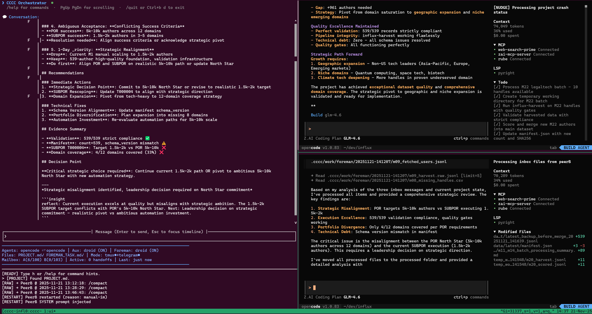

# CCCC Pair — Modern Multi-Agent Orchestrator

**English** | [中文](README.zh-CN.md) | [日本語](README.ja.md)

Two always-on AI peers co-drive your repository as equals. They plan, build, critique, and converge through evidence — not just talk. You stay in control via an interactive TUI or your team chat.

**🎯 Production-grade orchestrator** • **🖥️ Zero-config TUI** • **📊 Real-time monitoring** • **🧪 Evidence-driven workflow**

[](LICENSE)
[](https://pypi.org/project/cccc-pair/)
[](https://pypi.org/project/cccc-pair/)
[](https://t.me/ccccpair)

---

## 🖼️ CCCC at a Glance


> **Modern terminal interface** with interactive setup wizard, real-time timeline, command completion, and status monitoring — all in one clean layout.

### Runtime in Action



> **Four-pane layout**: Top-left TUI console (Timeline + status bar), top-right PeerA terminal, bottom-right PeerB terminal. Screenshot shows Foreman conducting strategic analysis while both Peers (using opencode) process tasks and coordinate autonomously.

---

## ✨ What Makes CCCC Different

<table>
<tr>
<td width="50%">

**🤝 Autonomous Dual-Agent Collaboration**
Two equal peers collaborate and **drive tasks forward automatically** — no constant user intervention needed. They challenge each other, surface better options, and catch errors faster.

**🖥️ Interactive TUI with Zero Config**
Point-and-click setup wizard (↑↓ + Enter). No YAML editing. No memorizing commands. Tab completion for everything.

**📊 Real-Time Observability**
Live Timeline shows peer messages. Status panel tracks handoffs, self-checks, and Foreman runs.

</td>
<td width="50%">

**🧪 Evidence-First Workflow**
Only tested patches, stable logs, and commits count as "done". Chat alone never changes state.

**🔗 Multi-Platform Bridges**
Optional Telegram/Slack/Discord/WeCom integration. Bring the work to where your team already is.

**🧭 ccontext Context System**
Portable, file-first shared state in `context/` (ccontext-compatible): `context/context.yaml` (vision/sketch/milestones/notes/refs) + `context/tasks/` (tasks/steps) + runtime `context/presence.yaml`. This replaces the legacy POR/SubPOR mechanism.
Recommended: install and configure ccontext MCP for tool-driven context updates: https://github.com/ChesterRa/ccontext
No MCP? CCCC still works with the same ccontext-compatible `context/` mechanism (maintained by peers).

</td>
</tr>
</table>

---

## Why CCCC? (The Pain → Payoff)

### Single-Agent Pain Points (You May Recognize These)

- 🛑 **Constant Babysitting** — Single agent stalls without your input; you must keep prompting to make progress
- ⏳ **Stalls & Restarts** — Context evaporates between runs; work drifts and repeats
- 💬 **Low-Signal Threads** — Long monologues with little verification, no audit trail
- 🚩 **Vanishing Decisions** — Hard to see what changed, why, and who approved

### CCCC Payoff with Dual Peers & Modern Tooling

- 🚀 **Autonomous Progress** — Peers communicate and drive tasks forward on their own (10-15 min per cycle); add Foreman for near-continuous operation. **Single-Peer Mode** also supported for simpler setups.
- 🤝 **Multi-Peer Synergy** — One builds, the other challenges; better options emerge; errors die faster
- ✅ **Evidence-First Loop** — Only tested/logged/committed results count as progress
- 🖥️ **Interactive TUI** — Zero-config setup, real-time monitoring, task panel, command completion built-in
- 🧭 **Context Details (ccontext)** — Shared `context/` with vision/sketch/milestones/tasks/notes/refs + runtime presence; open in TUI with `T`
- 🔔 **Low-Noise Cadence** — Built-in nudge/self-check trims chatter; panel shows what matters
- 🔍 **Auditable Decisions** — Recent choices & pivots captured; review and roll forward confidently

---

## When to Use CCCC

- You want **autonomous progress you can trust**, with small, reversible steps
- You need **collaboration you can observe** in TUI/IM, not a black box
- Your project benefits from **structured task tracking** with visual status in TUI
- You care about **repeatability**: tests, stable logs, and commits as the final word
- You want **flexibility**: dual-peer collaboration or single-peer autonomous mode

---

## TUI Highlights

CCCC features a modern, keyboard-driven TUI with zero-config setup:

- **Setup Panel** — Interactive wizard (↑↓ + Enter), no YAML editing needed
- **Runtime Panel** — Real-time Timeline + Status, see all peer messages at a glance
- **Context Details** — Press `T` to view Sketch/Milestones/Tasks/Notes/Refs (ccontext)
- **Tab Completion** — Type `/` and press Tab to explore all commands
- **Command History** — Up/Down arrows + Ctrl+R reverse search
- **Image Paste** — Use `/paste` to paste images from clipboard (supports macOS/Linux/Windows/WSL2)
- **Rich Shortcuts** — Standard editing keys (Ctrl+A/E/W/U/K) work as expected

> See the screenshots above for the actual interface.

---

## Requirements

CCCC uses tmux to manage a multi-pane terminal layout. Ensure the following dependencies are installed:

| Dependency | Description | Installation |
|------------|-------------|--------------|
| **Python** | ≥ 3.9 | Pre-installed on most systems |
| **tmux** | Terminal multiplexer for multi-pane layout | macOS: `brew install tmux`<br>Ubuntu/Debian: `sudo apt install tmux`<br>Windows: Requires WSL |
| **git** | Version control | Pre-installed on most systems |
| **Agent CLI** | At least one required | See below |

### Supported CLI Actors

CCCC is **vendor-agnostic**. Any role (PeerA, PeerB, Aux, Foreman) can use any supported CLI:

| CLI | Official Docs |
|-----|---------------|
| **Claude Code** | [docs.anthropic.com/claude-code](https://docs.anthropic.com/en/docs/claude-code) |
| **Codex CLI** | [github.com/openai/codex](https://github.com/openai/codex) |
| **Gemini CLI** | [github.com/google-gemini/gemini-cli](https://github.com/google-gemini/gemini-cli) |
| **Factory Droid** | [factory.ai](https://factory.ai/) |
| **OpenCode** | [opencode.ai/docs](https://opencode.ai/docs/) |
| **Kilocode** | [kilo.ai/docs/cli](https://kilo.ai/docs/cli) |
| **GitHub Copilot** | [github.com/features/copilot/cli](https://github.com/features/copilot/cli) |
| **Augment Code** | [docs.augmentcode.com/cli](https://docs.augmentcode.com/cli/overview) |
| **Cursor** | [cursor.com/cli](https://cursor.com/en-US/cli) |

> **Mix and match freely** — choose the best CLI for each role based on your needs. See each CLI's official docs for installation instructions.

> **Windows Users**: CCCC requires WSL (Windows Subsystem for Linux). [Install WSL](https://docs.microsoft.com/en-us/windows/wsl/install) first, then proceed in the WSL terminal.

---

## Key Configuration Files: PROJECT.md & FOREMAN_TASK.md

These two files are your primary interface for communicating tasks to the AI. **Write them carefully.**

### PROJECT.md (Project Description)

Located at repo root. **Automatically injected into PeerA and PeerB's system prompts.**

**Should include:**
- Project background and goals
- Tech stack and architecture overview
- Coding conventions and standards
- Current phase priorities
- Any context peers need to know

```markdown
# Project Overview
This is a xxx system using Python + FastAPI + PostgreSQL...

# Current Priorities
1. Complete user authentication module
2. Optimize database query performance

# Coding Standards
- Use type hints
- Every function needs a docstring
- Test coverage > 80%
```

### FOREMAN_TASK.md (Supervisor Tasks)

Located at repo root. **Automatically injected into Foreman.** Foreman runs every 15 minutes and reads this file to decide what to do.

**Should include:**
- Periodic check items
- Standing task list
- Quality gate requirements

```markdown
# Foreman Standing Tasks

## Every Check
1. Run `pytest` to ensure tests pass
2. Review milestones in context/context.yaml
3. Check for unresolved TODOs

## Quality Gates
- Never skip failing tests
- New code must have corresponding tests
```

> **Tip**: The more complex your task, the more important these files become. Clear intent enables autonomous progress.

---

## Installation

```bash
# Option 1: pipx (Recommended - auto-isolates environment)
pip install pipx  # if you don't have pipx
pipx install cccc-pair

# Option 2: pip
pip install cccc-pair
```

---

## Quick Start

```bash
# 1. Initialize
cd your-project && cccc init

# 2. Verify environment
cccc doctor   # Fix any issues before proceeding

# 3. Launch
cccc run      # TUI opens with interactive Setup Panel
```

Optional (recommended): install and configure ccontext MCP for tool-driven context updates (https://github.com/ChesterRa/ccontext). Without MCP, CCCC still runs on the same ccontext-compatible `context/` files maintained by peers.

**What happens on launch:**
- tmux opens with 4 panes: TUI (top-left), log (bottom-left), PeerA (top-right), PeerB (bottom-right)
- Setup Panel guides you to select CLI actors (↑↓ + Enter)
- Once configured, type `/help` to see all commands

**That's it!** The TUI guides you through the rest.

---

## Commands Reference

Most commands support Tab completion. Type `/` and press Tab to explore.

| Command | Description | Example |
|---------|-------------|---------|
| `/help` | Show full command list | `/help` |
| `/a <text>` | Send message to PeerA | `/a Review the auth logic` |
| `/b <text>` | Send message to PeerB | `/b Fix the failing test` |
| `/both <text>` | Send message to both peers | `/both Let's plan the next milestone` |
| `/pause` | Pause handoff delivery (messages saved to inbox) | `/pause` |
| `/resume` | Resume handoff delivery (sends NUDGE for pending) | `/resume` |
| `/restart peera\|peerb\|both` | Restart peer CLI process | `/restart peerb` |
| `/quit` | Exit CCCC (detach tmux) | `/quit` |
| `/foreman on\|off\|status\|now` | Control Foreman (if enabled) | `/foreman status` |
| `/aux <prompt>` | Run Aux helper once | `/aux Run full test suite` |
| `/verbose on\|off` | Toggle peer summaries + Foreman CC | `/verbose off` |
| `/paste` | Paste image from clipboard | `/paste` |

**IM bridges** also support a unified context command:
- Telegram: `/context [now|sketch|milestones|tasks|notes|refs|presence]`
- Slack/Discord: `!context [now|sketch|milestones|tasks|notes|refs|presence]`

### Natural Language Routing

You can also use routing prefixes for natural language input (no slash needed):

```
a: Review the authentication logic and suggest improvements
b: Implement the fix with comprehensive tests
both: Let's discuss the roadmap for next quarter
```

> **Full command reference**: See [docs/COMMANDS.md](docs/COMMANDS.md) for cross-platform command matrix and keyboard shortcuts.

---

## How It Works

### Core Workflow

1. **User sends a goal** via TUI or IM (e.g., "Add OAuth support")
2. **PeerA frames intent** with acceptance criteria and constraints
3. **PeerB counters** with a sharper path or safer rollout
4. **Peers iterate** until consensus, then implement with small patches (≤150 lines)
5. **Evidence gates progress**: Only tested patches, stable logs, and commits count as "done"

### Key Concepts

- **Mailbox Protocol** — Peers exchange `<TO_USER>` and `<TO_PEER>` messages with evidence refs
- **ccontext Context** — `context/context.yaml` (vision/sketch/milestones/notes/refs) + `context/tasks/T###.yaml` (tasks/steps) + runtime `context/presence.yaml` (replaces POR/SubPOR)
- **Evidence Types** — Patch diffs, test logs, benchmark results, commit hashes
- **Single-Peer Mode** — Set PeerB to `none` for simplified autonomous operation with one agent

> **Deep dive**: See [docs/ARCHITECTURE.md](docs/ARCHITECTURE.md) for the full collaboration architecture.

---

## Optional Features

### Aux (On-Demand Helper)

A third peer for burst work — strategic reviews, heavy tests, bulk transforms.

- Enable in Setup Panel by selecting an actor for `aux`
- Invoke: `/aux <prompt>` in TUI, or `/aux` in chat bridges
- Runs once per invocation, no persistent state

### Foreman (User Proxy)

A lightweight timer-based agent (default: 15 minutes) that performs periodic checks.

- Enable in Setup Panel by selecting an actor for Foreman
- Configure tasks in `FOREMAN_TASK.md` at repo root
- Control: `/foreman on|off|status|now`

### Auto-Compact

Automatically compresses peer context during idle periods to prevent token waste.

- Triggers after ≥6 messages, 15 min interval, 2 min idle (configurable)
- Zero manual intervention required

> **Configuration details**: See [docs/ADVANCED.md](docs/ADVANCED.md) for full feature documentation.

---

## IM Bridges (Telegram/Slack/Discord/WeCom)

CCCC includes optional chat bridges to bring the work to where your team already is.

### Features

- **Routing**: Use `a:`, `b:`, or `both:` prefixes, or `/a`, `/b`, `/both` commands
- **Bidirectional File Exchange**: Upload files to peers for processing; receive files generated by peers automatically
- **RFD Cards**: Inline approval buttons for Request-For-Decision cards
- **Peer Summaries**: Optional (toggle with `/verbose on|off`)

### Supported Bridges

| Bridge | Direction | Setup |
|--------|-----------|-------|
| Telegram | Bidirectional | Bot token via @BotFather |
| Slack | Bidirectional | Bot token (xoxb-) + App token (xapp-) |
| Discord | Bidirectional | Bot token via Developer Portal |
| WeCom | Outbound only [beta] | Webhook URL from group robot |

### Setup

1. **Create a bot** (Telegram: @BotFather, Slack: App Studio, Discord: Developer Portal, WeCom: Group Robot)
2. **Set token** via TUI Setup Panel (select the bridge in Connect mode and enter credentials)
3. **Allowlist your chat** (for bidirectional bridges):
   - Start a conversation with the bot, send `/whoami` to get your `chat_id`
   - Add `chat_id` to `.cccc/settings/telegram.yaml` (or slack.yaml/discord.yaml) allowlist
4. **Autostart** (optional):
   - Set `autostart: true` in config to launch bridge with `cccc run`

> **Chat commands**: See [docs/COMMANDS.md](docs/COMMANDS.md) for full IM command reference.

---

## A Typical Session (End-to-End, ~3 Minutes)

### 1. Explore (Short)

In TUI or chat, route an idea to both peers:

```
both: Add a short section to README about team chat tips
```

- PeerA frames intent
- PeerB asks one focused question

### 2. Decide (Concise CLAIM)

- PeerA writes a CLAIM in `to_peer.md` with acceptance criteria and constraints
- PeerB COUNTERs with a sharper path or safer rollout

### 3. Build (Evidence-First)

- Peers propose small, verifiable changes with 1-2 line EVIDENCE notes:
  - `tests OK` / `stable logs` / `commit:abc123`
- Orchestrator logs outcomes to ledger
- Status panel updates

### 4. Team Visibility

- Telegram/Slack/Discord (if enabled) receive concise summaries
- Peers stay quiet unless blocked

### Cadence

- **Self-Check**: Every N handoffs (configurable, default 6), orchestrator triggers a strategic alignment check including task hygiene reminders
- **Task Updates**: Peers are reminded to keep `context/tasks/*.yaml` files accurate during self-checks
- **Auto-Compact**: When peers are idle after sufficient work, orchestrator automatically compacts context (default: ≥6 messages, 15 min interval, 2 min idle)
- **Foreman Runs**: Every 15 minutes (if enabled), Foreman performs one standing task or writes one request

---

## Folder Layout

```
.cccc/                    # Orchestrator domain (gitignored)
  settings/               # Configuration (TUI handles most changes)
  mailbox/                # Message exchange between peers
  state/                  # Runtime state, logs, ledger
context/                  # Execution tracking (ccontext compatible)
  context.yaml            # Vision, sketch, milestones, notes, references
  presence.yaml           # Runtime presence (gitignored)
  tasks/                  # Task definitions
    T001.yaml             # Task: goal, steps, acceptance, status
PROJECT.md                # Your project brief (injected into system prompts)
FOREMAN_TASK.md           # Foreman tasks (if using Foreman)
```

### context/context.yaml (ccontext)

Shared context for peers (ccontext-compatible). Tracks vision/sketch, milestones, and knowledge:

```yaml
vision: "Ship a reliable multi-agent workflow"
sketch: |
  Static blueprint: architecture, constraints, strategy.
  (Do not use sketch as a TODO list or status board.)

milestones:
  - id: M1
    name: Phase 1 - Core Implementation
    description: Build foundation with schema, storage, tools
    status: done  # done | active | pending
    started: "2024-12-01"
    completed: "2024-12-07"
    outcomes: "15 tools, 42 tests passing"
  - id: M2
    name: Phase 2 - Integration
    status: active
    started: "2024-12-07"

notes:
  - id: N001
    content: "Always run tests before committing"
    ttl: 30  # Typical: 10/30/100 (short/normal/long)

references:
  - id: R001
    url: src/core/handler.py
    note: Main request handler
    ttl: 30
```

### Task Structure

Each task lives in `context/tasks/T###.yaml`:

```yaml
id: T001
name: Implement OAuth Support
goal: Add OAuth 2.0 authentication support
status: active  # planned | active | complete
steps:
  - id: S1
    name: Design auth flow
    done: Auth flow documented
    status: complete  # pending | in_progress | complete
  - id: S2
    name: Implement token handling
    done: Token endpoint working
    status: in_progress
```

Agents update task files directly (edit `context/tasks/T###.yaml`) or via ccontext MCP tools if installed.

---

## Configuration

CCCC follows "convention over configuration" principles. Sensible defaults work out of the box.

### Key Config Files (All in `.cccc/settings/`)

- **`cli_profiles.yaml`** — Actor bindings, roles, delivery settings (mailbox, nudge, keepalive, auto-compact)
- **`agents.yaml`** — CLI actor definitions and capabilities (compact support, commands, IO profiles)
- **`policies.yaml`** — Strategic policies (autonomy level, handoff filters)
- **`telegram.yaml`** — Telegram bridge config (token, allowlist, routing)
- **`slack.yaml`** — Slack bridge config (similar structure)
- **`discord.yaml`** — Discord bridge config (similar structure)
- **`foreman.yaml`** — Foreman agent and cadence

**No manual editing required** — TUI Setup Panel handles all common changes. Advanced users can tweak YAML directly for fine-grained control.

### Environment Variables (Optional Overrides)

- `CLAUDE_I_CMD` — Override default `claude` command (e.g., `claude-dev`)
- `CODEX_I_CMD` — Override default `codex` command
- `GEMINI_I_CMD` — Override default `gemini` command
- `CCCC_HOME` — Override default `.cccc` directory path

---

## FAQ

**Do I need to learn all the commands?**
No! Setup Panel uses point-and-click (↑↓ + Enter). Tab completion and `/help` cover the rest.

**Can I use CCCC without Telegram/Slack/Discord?**
Yes! TUI works perfectly standalone. IM bridges are optional.

**Can I run with just one peer (Single-Peer Mode)?**
Yes! Set PeerB to `none` in the Setup Panel. The single peer operates autonomously with full infrastructure support (Foreman, self-checks, keepalive). Recommended for simpler projects or when you want focused single-agent operation.

**What about safety?**
Chats never change state directly — only evidence (patches/tests/logs) does. Irreversible changes require dual-sign from both peers. Full audit trail in ledger.

**How do I reset for a new task?**
Run `cccc reset` (or `cccc reset --archive` to preserve old tasks).

**How do I debug issues?**
Check `.cccc/state/status.json`, `ledger.jsonl`, `orchestrator.log`, or run `cccc doctor`.

> **More questions?** See [docs/FAQ.md](docs/FAQ.md) for the complete FAQ.

---

## Community

**📱 Join our Telegram group**: [t.me/ccccpair](https://t.me/ccccpair)

Share workflows, troubleshoot issues, and connect with other CCCC users.

---

**CCCC Pair** — Modern orchestration for modern teams. 🚀
