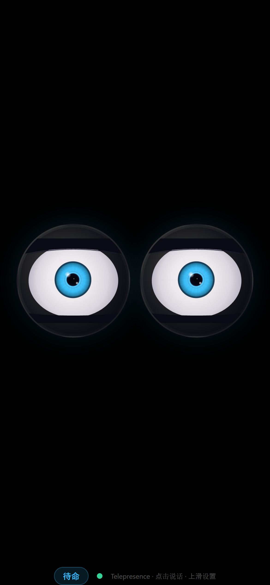
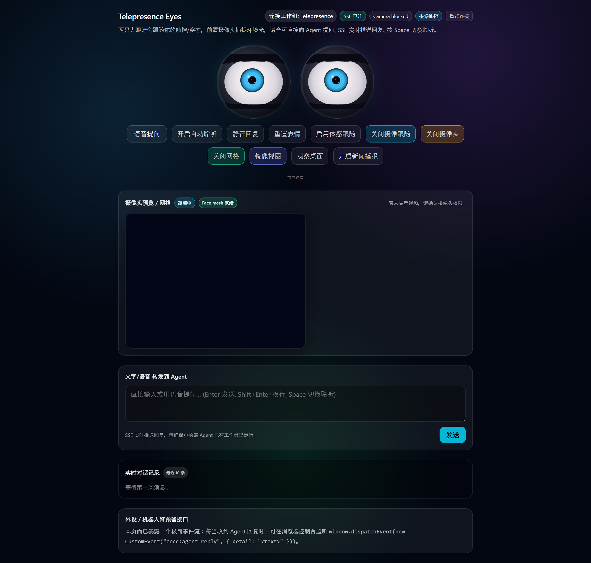

<div align="center">

# AI 语音伴侣 — Telepresence Eyes

**一对会动的眼睛，随时跟你对话。**<br>
手机上随身携带，桌面上观察你的工作，自动播报新闻。

<br>


<br><br>

`feat/voice-agent` · 26 files · +3,818 / −1,331 lines

</div>

---

## 这是什么？

一个跑在浏览器里的 AI 伴侣界面。两只逼真的眼睛会跟随你的鼠标、面部、手机倾斜而转动，能听你说话、用语音回答、观察你的桌面内容、定时播报新闻。

<table>
<tr>
<td width="65%">

<p align="center"><b>桌面端</b> — 完整控制面板</p>
</td>
<td width="35%">

<p align="center"><b>手机端</b> — 全屏伴侣模式</p>
</td>
</tr>
</table>

---

## 能做什么？

| | 功能 | 说明 |
|---|---|---|
| 🎤 | **语音对话** | 对着麦克风说话，AI 实时听懂后语音回答。支持自动聆听模式 |
| 👀 | **逼真眼睛** | Canvas2D 逐帧渲染：虹膜纤维、瞳孔缩放、微跳视、自然眨眼，5 种情绪表情 |
| 📱 | **手机随身伴侣** | 全屏黑色背景，点击任意处说话。防息屏、和桌面共享同一工作组 |
| 💻 | **桌面截屏观察** | 每隔 30 秒截取桌面发给 AI 分析，发现有趣内容会主动评论 |
| 📰 | **新闻自动播报** | 配置感兴趣的话题，AI 定时搜索最新新闻，整理成中文摘要语音朗读 |
| 🎬 | **面部跟随** | 摄像头捕捉面部位置，眼睛跟着你转，像在真的看着你 |

---

## 表情系统

眼睛不只是装饰。瞳孔大小、虹膜发光、眼皮形态都会根据 AI 当前状态变化：

<table>
<tr>
<td width="50%">

</td>
<td width="50%">

**聆听时** — 瞳孔放大 1.25x，眼睛睁大，像在认真听你说话

**思考时** — 瞳孔缩小 0.75x，目光偏左上，微微眯眼

**播报时** — 虹膜发光脉动，瞳孔边缘柔光

**出错时** — 瞳孔大张 1.35x，血丝加重，眼皮下垂

</td>
</tr>
</table>

7 层渲染：眼窝阴影 → 巩膜+血丝 → 虹膜（60 根纤维+发光环） → 瞳孔 → 3 个高光点 → 贝塞尔曲线眼皮 → 情绪光晕。每只眼睛 60fps 实时绘制。

---

## 怎么运作的？

```
你说话 ──→ CCCC 后端 ──→ Claude AI ──→ 实时推回浏览器 ──→ 语音朗读
 (语音识别)    (消息路由)    (思考/回复)    (SSE 推送)       (TTS 分句播报)
```

- 浏览器语音识别转文字，发送到 CCCC 后端
- Claude AI 处理，眼睛自动切换到「思考」表情
- SSE 实时推送回复（不是轮询），延迟极低
- TTS 分句朗读回答，不会因为文字太长而截断

---

## 桌面 + 手机，同一个 AI

桌面端有完整控制面板：语音、摄像头、截屏、新闻。<br>
手机端是极简全屏模式：点一下就说话，上滑打开设置。<br>
两端可以连同一个工作组，共享对话。



<p align="center">桌面端 — 眼睛 + 控制按钮 + 摄像头预览 + 对话记录</p>

---

<div align="center">

基于 [CCCC](https://github.com/aspect-build/cccc) 多智能体协作内核 · [完整 HTML 报告](docs/voice-agent-upgrade-report.html)

</div>
