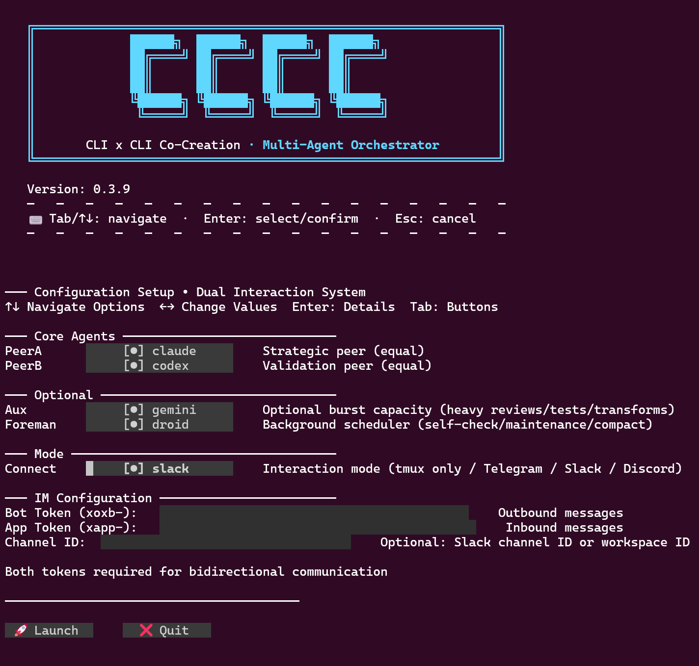

# CCCC Pair — Modern Multi-Agent Orchestrator

Two always-on AI peers co-drive your repository as equals. They plan, build, critique, and converge through evidence — not just talk. You stay in control via an interactive TUI or your team chat.

**🎯 Production-grade orchestrator** • **🖥️ Zero-config TUI** • **📊 Real-time monitoring** • **🧪 Evidence-driven workflow**

[](https://t.me/ccccpair)

---

## 🖼️ CCCC at a Glance



> **Modern terminal interface** with interactive setup wizard, real-time timeline, command completion, and status monitoring — all in one clean layout.

---

## ✨ What Makes CCCC Different

<table>
<tr>
<td width="50%">

**🤝 Dual-Agent Collaboration**
Two equal peers (not solo AI + tools) that challenge each other, surface better options, and catch errors faster.

**🖥️ Interactive TUI with Zero Config**
Point-and-click setup wizard (↑↓ + Enter). No YAML editing. No memorizing commands. Tab completion for everything.

**📊 Real-Time Observability**
Live Timeline shows peer messages. Status panel tracks handoffs, self-checks, and Foreman runs.

</td>
<td width="50%">

**🧪 Evidence-First Workflow**
Only tested patches, stable logs, and commits count as "done". Chat alone never changes state.

**🔗 Multi-Platform Bridges**
Optional Telegram/Slack/Discord integration. Bring the work to where your team already is.

**📋 Repo-Native Anchors**
Strategic board (POR.md) and per-task sheets (SUBPOR.md) live in your repo. Everyone sees the same truth.

</td>
</tr>
</table>

---

## Why CCCC? (The Pain → Payoff)

### Single-Agent Pain Points (You May Recognize These)

- ⏳ **Stalls & Restarts** — Context evaporates between runs; work drifts and repeats
- 💬 **Low-Signal Threads** — Long monologues with little verification, no audit trail
- 🚩 **Vanishing Decisions** — Hard to see what changed, why, and who approved

### CCCC Payoff with Dual Peers & Modern Tooling

- 🤝 **Multi-Peer Synergy** — One builds, the other challenges; better options emerge; errors die faster
- ✅ **Evidence-First Loop** — Only tested/logged/committed results count as progress
- 🖥️ **Interactive TUI** — Zero-config setup, real-time monitoring, command completion built-in
- 📋 **POR/SUBPOR Anchors** — One strategic board (POR) + per-task sheets (SUBPOR) keep everyone aligned without ceremony
- 🔔 **Low-Noise Cadence** — Built-in nudge/self-check trims chatter; panel shows what matters
- 🔍 **Auditable Decisions** — Recent choices & pivots captured; review and roll forward confidently

---

## When to Use CCCC

- You want **autonomous progress you can trust**, with small, reversible steps
- You need **collaboration you can observe** in TUI/IM, not a black box
- Your project benefits from a **living strategic board** and lightweight task sheets in the repo
- You care about **repeatability**: tests, stable logs, and commits as the final word

---

## Quick Look: TUI Interface Overview

CCCC features a modern, keyboard-driven TUI with two main modes:

### Setup Interface (Interactive Configuration Wizard)

```
┌─ CCCC Setup ─────────────────────────────────────────────────────────┐
│ ⬆️⬇️ Navigate  │ Enter Apply  │ Esc Cancel  │ /setup Toggle         │
├──────────────────────────────────────────────────────────────────────┤
│ Roles (select actors for each peer):                                 │
│   peerA: claude          peerB: codex                                │
│   [✓] set peerA→claude  [✓] set peerB→codex                        │
│   [ ] set peerA→gemini  [ ] set peerB→droid                          │
│   aux: none                                                          │
│   [✓] set aux→none      [ ] set aux→gemini                          │
│                                                                      │
│ CLI Availability:                                                    │
│   ✓ PeerA (claude): Available                                       │
│   ✓ PeerB (codex): Available                                        │
│                                                                      │
│ Telegram/Slack/Discord:                                              │
│   configured: YES   running: YES   autostart: YES                    │
│   [ ] Set token...  [ ] Token unset                                  │
└──────────────────────────────────────────────────────────────────────┘
```

### Runtime Interface (Real-Time Collaboration View)

```
┌─ CCCC Orchestrator v0.3.x ───────────────────────────────────────────┐
│ Two equal AI peers co-drive delivery; evidence first.                │
├─ Timeline ───────────────────────────┬─ Status ──────────────────────┤
│ [12:34:56] SYS Orchestrator ready    │ Connection: ● Connected       │
│ [12:35:01] PeerA: Analyzing auth...  │ PeerA: 12 handoffs (next: 18) │
│ [12:35:15] PeerB: Running tests...   │ PeerB: 11 handoffs (next: 19) │
│ [12:35:30] System: Tests passed ✓    │ Updated: 2s ago              │
│ [12:35:45] You > PeerA: Review PR    │ Foreman: next @ 15:00         │
│ [12:36:00] PeerA: LGTM, approved     │                               │
│                                      │                               │
│ (PageUp/PageDown to scroll)          │                               │
├─ Input ──────────────────────────────┴───────────────────────────────┤
│ ❯ /help                              [Tab: complete | Up/Down: hist] │
├─ Shortcuts ──────────────────────────────────────────────────────────┤
│ Ctrl+A/E: line │ Ctrl+W: del word │ PageUp/Down: scroll │ /quit      │
└──────────────────────────────────────────────────────────────────────┘
```

**Key Features:**
- ✅ **Tab Completion** — Type `/` and press Tab to see all commands
- ✅ **Command History** — Use Up/Down arrows to navigate previous commands
- ✅ **Reverse Search** — Press Ctrl+R to search command history
- ✅ **Rich Shortcuts** — Standard editing keys (Ctrl+A/E/W/U/K) work as expected
- ✅ **Visual Feedback** — Every action shows clear success/error messages

---

## Requirements

- **Python** `>= 3.9`
- **tmux** (`brew install tmux` or `sudo apt install tmux`)
- **git**

### Recommended CLI Actors

- 🔵 **Peer A (default)**: Claude Code — Strong reasoning, careful edits, robust long sessions
- 🟡 **Peer B (default)**: Codex CLI — Decisive implementation, fast iteration, stable CLI behavior
- ✨ **Aux (optional)**: Gemini CLI — On-demand helper for burst work (reviews, tests, bulk transforms)

**Also supported**: Factory Droid, OpenCode — All actors can serve as Peer or Aux.

> **Note**: CCCC is vendor-agnostic. Any CLI that follows the simple mailbox contract can participate.

---

## Installation

### Option 1: pipx (Recommended)

```bash
pipx install cccc-pair
```

### Option 2: venv

```bash
python3 -m venv venv
source venv/bin/activate  # or `venv\Scripts\activate` on Windows
pip install cccc-pair
```

---

## Quick Start (5 Minutes)

### 1. Initialize Your Repository

```bash
cd your-project
cccc init
```

This creates the `.cccc/` orchestrator domain (gitignored by default) and `docs/por/` anchors.

### 2. Verify Your Environment

```bash
cccc doctor
```

Checks for Python version, tmux, git, and recommended CLI actors.

### 3. (Optional) Connect Team Chat

```bash
cccc token set  # Paste your Telegram bot token (stored securely in .cccc/settings)
```

> Telegram/Slack/Discord bridges are optional. CCCC works perfectly standalone.

### 4. Launch the TUI

```bash
cccc run
```

**What happens:**
- tmux opens with a clean 3-pane layout:
  - **Left**: CCCC TUI (Setup + Timeline + Input + Status)
  - **Top-right**: PeerA terminal
  - **Bottom-right**: PeerB terminal
- **Setup Panel** opens automatically if this is your first run
- **No configuration files to edit** — everything is point-and-click

### 5. Configure Interactively (First Run)

The **Setup Panel** guides you through configuration:

1. **Select Actors** (↑↓ to navigate, Enter to apply):
   - Set `peerA` → `claude`
   - Set `peerB` → `codex`
   - Set `aux` → `none` (or choose an actor for on-demand help)

2. **Verify CLI Availability**:
   - TUI automatically checks if `claude`, `codex`, etc. are on PATH
   - If a CLI is missing, the panel shows hints (e.g., "Install with `pip install claude-code`")

3. **(Optional) Configure Telegram**:
   - If you ran `cccc token set` earlier, you'll see `configured: YES`
   - Otherwise, select `Set token...` to enter your bot token inline

4. **Launch**:
   - Once configured, Setup Panel auto-collapses
   - Focus moves to the Input field
   - Type `/help` (or press Tab) to see all commands

**That's it!** The TUI guides you through the rest.

---

## Using CCCC TUI

### Setup Panel (Interactive Wizard)

The Setup Panel appears on first launch and can be toggled anytime with `/setup`.

**Navigation:**
- `↑↓` — Move between options
- `Enter` — Apply selection (e.g., bind actor to role)
- `Esc` — Cancel inline input (e.g., token entry)
- `/setup` — Toggle panel visibility

**Features:**
- **Role Binding**: Point-and-click to assign actors to PeerA/PeerB/Aux
- **CLI Check**: Real-time availability status for each actor
- **IM Config**: Set/unset Telegram/Slack/Discord tokens inline
- **Zero YAML Editing**: All changes written to config files automatically

### Runtime Panel (Real-Time Collaboration)

Once Setup is complete, you interact with peers through the Runtime Panel.

**Timeline** (scrollable message stream):
- Displays all messages from PeerA, PeerB, System, and You
- Auto-scrolls to latest, or use `PageUp/PageDown` to review history
- Soft limit: 1200 lines (trims to 800 when exceeded, preserving recent context)

**Input** (command entry with rich features):
- **Tab Completion**: Type `/` and press Tab to see all commands
- **History**: Use `Up/Down` to cycle through previous commands
- **Reverse Search**: Press `Ctrl+R` to search history (like bash/zsh)
- **Standard Editing**: `Ctrl+A/E` (line start/end), `Ctrl+W/U/K` (delete word/start/end)

**Status** (live system info):
- Connection status (● Connected / ○ Disconnected)
- Handoff counts for PeerA/PeerB with next self-check thresholds
- Last update timestamp
- Foreman status (if enabled): next run time, last exit code

---

## Commands Reference

All commands are accessible via Tab completion. Just type `/` and press Tab to explore.

| Command | Description | Example |
|---------|-------------|---------|
| `/help` | Show full command list | `/help` |
| `/a <text>` | Send message to PeerA | `/a Review the auth logic` |
| `/b <text>` | Send message to PeerB | `/b Fix the failing test` |
| `/both <text>` | Send message to both peers | `/both Let's plan the next milestone` |
| `/pause` | Pause handoff loop | `/pause` |
| `/resume` | Resume handoff loop | `/resume` |
| `/refresh` | Refresh system prompts | `/refresh` |
| `/quit` | Exit CCCC (detach tmux) | `/quit` |
| `/setup` | Toggle Setup Panel | `/setup` |
| `/foreman on\|off\|status\|now` | Control Foreman (if enabled) | `/foreman status` |
| `/c <prompt>` | Invoke Aux once | `/c Run full test suite` |
| `/review` | Request Aux review | `/review` |
| `/focus [hint]` | Focus PeerB on a topic | `/focus performance` |
| `/verbose on\|off` | Toggle peer summaries + Foreman CC | `/verbose off` |

### Natural Language Routing

You can also use routing prefixes for natural language input (no slash needed):

```
a: Review the authentication logic and suggest improvements
b: Implement the fix with comprehensive tests
both: Let's discuss the roadmap for next quarter
```

---

## Keyboard Shortcuts

CCCC TUI includes rich keyboard support for efficiency.

| Shortcut | Action |
|----------|--------|
| `Tab` | Auto-complete commands |
| `Up / Down` | Navigate command history |
| `Ctrl+R` | Reverse search history |
| `Ctrl+A` | Jump to line start |
| `Ctrl+E` | Jump to line end |
| `Ctrl+W` | Delete word backward |
| `Ctrl+U` | Delete to line start |
| `Ctrl+K` | Delete to line end |
| `PageUp / PageDown` | Scroll timeline |
| `Ctrl+L` | Clear timeline |
| `/quit` | Exit CCCC |
| `Ctrl+B D` | Detach tmux (alternative exit) |

> **Pro tip**: Use `Ctrl+R` to quickly find and re-run previous commands without retyping.

---

## How It Works (Architecture)

### The Core Contract

CCCC uses a simple, file-based mailbox contract:

- **Peers write** `<TO_USER>` and `<TO_PEER>` messages with a trailing fenced `insight` block
- **Messages include**: who (from), kind (claim/counter/evidence/progress), next step, refs (evidence pointers)
- **Evidence types**: patch diffs, test logs, benchmark results, commit hashes
- **State changes**: Only messages with valid evidence (e.g., `patch.diff`, `test:passed`) affect the codebase

### Repo-Native Anchors (POR/SUBPOR)

Strategy and execution live in your repository under `docs/por/`:

- **`POR.md`** (strategic board): North star, deliverables, roadmap (Now/Next/Later), risk radar, recent decisions
- **`T######-slug/SUBPOR.md`** (per-task sheet): Goal, acceptance criteria, cheapest probe, kill criteria, implementation notes, next step

Peers update these naturally as they work. You can read them anytime to see the big picture.

### Collaboration Architecture

```
┌─────────────────────────────────────────────────────────────────┐
│  User Layer                                                     │
│                     ┌──────────────────┐                        │
│                     │      User        │                        │
│                     │  (Vision, RFD)   │                        │
│                     └────────┬─────┬───┘                        │
└──────────────────────────────┼─────┼────────────────────────────┘
                               │     │ delegates
                      direct   │     ↓
                      command  │  ┌──────────────────┐
                               │  │    Foreman       │
┌──────────────────────────────┼──┤  (scheduled run) │────────────┐
│  Orchestration Layer         │  └────────┬─────────┘            │
│                              │           │ periodic check/nudge │
│                   ┌──────────┴───────────┴───────┐              │
│                   │  ┌───────────────────────┐   │              │
│                   │  │  Aux (Strategic)      │   │              │
│                   │  └──────────┬────────────┘   │              │
│                   │             ↕                │              │
│                   │         invoke/return        │              │
│                   │             │                │              │
│                   ↓             ↓                ↓              │
│              ┌──────────────────────────────────────┐           │
│              │      PeerA  ◄───────►  PeerB         │           │
│              └────────┬───────────────────────┬─────┘           │
│                       │                       ↕                 │
│                       │            ┌─────────────────────┐      │
│                       │            │  Aux (Tactical)     │      │
│                       │            │  invoke/return      │      │
│                       │            └───────────┬─────────┘      │
└───────────────────────┼────────────────────────┼────────────────┘
                        │                        │
                        ↓                        ↓
┌─────────────────────────────────────────────────────────────────┐
│  Artifact Layer (Persistent State)                              │
│       ┌──────────┐       ┌────────────┐       ┌──────────┐      │
│       │ Codebase │       │   Ledger   │       │ POR/     │      │
│       │(patches) │       │  (audit)   │       │ SUBPOR   │      │
│       └──────────┘       └────────────┘       └──────────┘      │
└─────────────────────────────────────────────────────────────────┘
```

**Key Relationships:**
- **User → Peers**: Direct commands or delegated through Foreman (scheduled)
- **Peers ⇄ Aux**: Invoke strategic (POR review) or tactical (tests, bulk work) help as needed
- **Peers → Artifacts**: Generate evidence (patches, tests, logs) directly or via Aux
- **Foreman**: Optional user proxy for periodic health checks and task scheduling
- **Aux**: Optional on-demand helper, invoked by peers for strategic or tactical work

1. **User sends a goal** via TUI or IM (e.g., "Add OAuth support")
2. **PeerA frames intent** (CLAIM) with acceptance criteria and constraints
3. **PeerB counters** with a sharper path or safer rollout
4. **Peers iterate** until consensus, then implement with small patches (≤150 lines)
5. **Evidence gates progress**: Only tested patches, stable logs, and commits count as "done"
6. **Orchestrator logs outcomes** to ledger; status panel updates in real-time

---

## Advanced Features

### Auto-Compact (Context Compression)

CCCC includes intelligent auto-compact to prevent peer context degradation during long-running sessions.

**How it works:**
- **Idle Detection**: Automatically detects when peers are idle (no inflight messages, no queued work, sufficient silence)
- **Work Threshold**: Only triggers after meaningful work (≥6 messages exchanged since last compact)
- **Interval Gating**: Respects minimum time interval (default: 15 minutes) to avoid wasteful compaction
- **Per-Actor Support**: Each CLI actor declares compact capability in `agents.yaml` (e.g., `/compact` for Claude Code, `/compress` for Gemini CLI)

**Configuration** (in `.cccc/settings/cli_profiles.yaml`):
```yaml
delivery:
  auto_compact:
    enabled: true                    # Global toggle
    min_interval_seconds: 900        # Wait 15 min between compacts
    min_messages_since_last: 6       # Require ≥6 messages of work
    idle_threshold_seconds: 120      # Peer must be idle for 2 min
    check_interval_seconds: 120       # Check every 2 minutes
```

**Benefits:**
- Maintains peer mental clarity across multi-hour sessions
- Prevents context window bloat and token waste
- Zero manual intervention — works automatically in the background

**Diagnostics:**
- Check `.cccc/state/ledger.jsonl` for `auto-compact` and `auto-compact-skip` events
- Logs include reason codes (e.g., `insufficient-messages`, `not-idle`, `time-interval`)

---

### Aux (Optional On-Demand Helper)

Aux is a third peer for burst work (e.g., broad reviews, heavy tests, bulk transforms).

**Enable at startup:**
- In Setup Panel, select an actor for `aux` (e.g., `gemini`)
- Or set `aux→none` to disable

**Invoke Aux:**
- In TUI: `/c <prompt>` or `/review`
- In chat bridges: `/aux-cli "<prompt>"`

**Use cases:**
- Strategic reviews (check POR against all SUBPORs)
- Heavy lifting (run full test suites, generate bulk fixtures)
- External checks (dependency audits, security scans)

**Note**: Aux runs once per invocation. No persistent state between runs.

### Foreman (User Proxy)

Foreman is a lightweight "user proxy" that runs on a timer (default: 15 minutes) and performs one non-interactive task or writes one short user-voice request to the right peer.

**Enable at startup:**
- In Setup Panel, choose an actor for Foreman (or `none` to disable)
- You can reuse Aux actor or pick a different one

**Configure:**
- Edit `./FOREMAN_TASK.md` (free-form: describe what matters now and list standing tasks)
- System rules live at `.cccc/rules/FOREMAN.md` (auto-generated, no manual edits)

**Visibility:**
- Status panel shows: `Foreman: RUNNING | last @ HH:MM rc=N | next @ HH:MM`
- IM shows messages as `[FOREMAN→PeerA]` or `[FOREMAN→PeerB]`

**Controls:**
- `/foreman on|off|status|now` (only if Foreman was enabled at startup)
- `/verbose on|off` toggles Foreman CC to chat

**Use cases:**
- Periodic health checks (run tests every 30 minutes)
- Reminder to update POR/SUBPORs
- Enforce quality gates (lint, type-check before commit)

---

## IM Bridges (Telegram/Slack/Discord)

CCCC includes optional chat bridges to bring the work to where your team already is.

### Features

- **Routing**: Use `a:`, `b:`, or `both:` prefixes, or `/a`, `/b`, `/both` commands
- **File Exchange**: Upload files to peers, download outputs from `.cccc/work/upload/outbound/`
- **RFD Cards**: Inline approval buttons for Request-For-Decision cards
- **Peer Summaries**: Optional (toggle with `/showpeers on|off`)

### Setup

1. **Create a bot** (Telegram: @BotFather, Slack: App Studio, Discord: Developer Portal)
2. **Set token**:
   ```bash
   cccc token set  # Or via TUI Setup Panel
   ```
3. **Allowlist your chat**:
   - Start a conversation with the bot, send `/whoami` to get your `chat_id`
   - Add `chat_id` to `.cccc/settings/telegram.yaml` (or slack.yaml/discord.yaml) allowlist
4. **Autostart** (optional):
   - Set `autostart: true` in config to launch bridge with `cccc run`

### Commands in Chat

- `/help` — Usage and routing tips
- `/whoami` — Get your `chat_id` for allowlist
- `/status` — View orchestrator snapshot
- `/showpeers on|off` — Toggle peer↔peer summaries
- `/files [in|out] [N]` — List recent files
- `a: <message>` — Send to PeerA
- `b: <message>` — Send to PeerB
- `both: <message>` — Send to both

---

## A Typical Session (End-to-End, ~3 Minutes)

### 1. Explore (Short)

In TUI or chat, route an idea to both peers:

```
both: Add a short section to README about team chat tips
```

- PeerA frames intent
- PeerB asks one focused question

### 2. Decide (Concise CLAIM)

- PeerA writes a CLAIM in `to_peer.md` with acceptance criteria and constraints
- PeerB COUNTERs with a sharper path or safer rollout

### 3. Build (Evidence-First)

- Peers propose small, verifiable changes with 1-2 line EVIDENCE notes:
  - `tests OK` / `stable logs` / `commit:abc123`
- Orchestrator logs outcomes to ledger
- Status panel updates

### 4. Team Visibility

- Telegram/Slack/Discord (if enabled) receive concise summaries
- Peers stay quiet unless blocked

### Cadence

- **Self-Check**: Every N handoffs (configurable, default 20), orchestrator triggers a short alignment check
- **POR Update**: PeerB receives periodic reminders to review `POR.md` and all active `SUBPOR.md` files
- **Auto-Compact**: When peers are idle after sufficient work, orchestrator automatically compacts context (default: ≥6 messages, 15 min interval, 2 min idle)
- **Foreman Runs**: Every 15 minutes (if enabled), Foreman performs one standing task or writes one request

---

## Folder Layout (After `cccc init`)

```
.cccc/
  adapters/bridge_*.py            # Chat bridges (optional: Telegram/Slack/Discord)
  orchestrator/                    # Core orchestrator modules
    handoff.py                     # Handoff delivery + self-check
    auto_compact.py                # Auto-compact logic
    keepalive.py                   # Keepalive nudge system
    foreman_scheduler.py           # Foreman scheduling
    ...
  settings/                        # Configuration files (no manual edit needed)
    cli_profiles.yaml              # Actor bindings, delivery config
    agents.yaml                    # CLI actor definitions
    policies.yaml                  # Strategic policies
    telegram.yaml / slack.yaml     # IM bridge configs
    foreman.yaml                   # Foreman config
  mailbox/                         # Message exchange (to_user.md, to_peer.md, inbox/, processed/)
  state/                           # Runtime state (ephemeral, gitignored)
    ledger.jsonl                   # Event log with auto-compact diagnostics
    orchestrator.log               # Runtime logs
    status.json                    # Current orchestrator state
  logs/                            # Peer CLI logs (ephemeral)
  work/                            # Shared workspace (gitignored)
  tui_ptk/app.py                   # TUI implementation
  orchestrator_tmux.py             # Main orchestrator runtime
  prompt_weaver.py                 # System prompt builder
  ...

docs/
  por/
    POR.md                         # Strategic board (North star, roadmap, decisions)
    T000123-your-task/SUBPOR.md    # Per-task sheet (goal/acceptance/probe/next)

PROJECT.md                         # Your project brief (woven into system prompts)
FOREMAN_TASK.md                    # Foreman task brief (if using Foreman)
```

---

## Configuration

CCCC follows "convention over configuration" principles. Sensible defaults work out of the box.

### Key Config Files (All in `.cccc/settings/`)

- **`cli_profiles.yaml`** — Actor bindings, roles, delivery settings (mailbox, nudge, keepalive, auto-compact)
- **`agents.yaml`** — CLI actor definitions and capabilities (compact support, commands, IO profiles)
- **`policies.yaml`** — Strategic policies (autonomy level, handoff filters)
- **`telegram.yaml`** — Telegram bridge config (token, allowlist, routing)
- **`slack.yaml`** — Slack bridge config (similar structure)
- **`discord.yaml`** — Discord bridge config (similar structure)
- **`foreman.yaml`** — Foreman agent and cadence

**No manual editing required** — TUI Setup Panel handles all common changes. Advanced users can tweak YAML directly for fine-grained control.

### Environment Variables (Optional Overrides)

- `CLAUDE_I_CMD` — Override default `claude` command (e.g., `claude-dev`)
- `CODEX_I_CMD` — Override default `codex` command
- `GEMINI_I_CMD` — Override default `gemini` command
- `CCCC_HOME` — Override default `.cccc` directory path

---

## FAQ

### Do I need to learn all the commands?

**No!** The Setup Panel uses point-and-click (↑↓ + Enter). Tab completion helps with commands in the Runtime Panel. Type `/help` anytime to see everything.

### Can I use CCCC without Telegram/Slack/Discord?

**Yes!** TUI works perfectly standalone. IM bridges are optional and add team collaboration, but they're not required.

### Does CCCC lock me into a specific UI?

**No.** Tmux TUI is the default, but the orchestrator is transport-agnostic. You can interact via TUI, IM bridges, or even direct file writes to the mailbox.

### What if I prefer typing commands over point-and-click?

**Go for it!** The Setup Panel is for convenience. Power users can use slash commands (e.g., `/a`, `/b`) or natural language routing (e.g., `a: Fix the bug`) exclusively.

### Can I run CCCC only locally (no cloud services)?

**Yes.** Everything works without any bridge. Peers run locally via CLI actors. No cloud dependencies unless you explicitly configure IM bridges.

### What about safety?

- **Chats never change state** directly — only evidence (patches/tests/logs) does
- **"Done" means verified** — tests passed, logs stable, commit referenced
- **Irreversible changes** (schema, public API, releases) require explicit dual-sign from both peers
- **Soft path locks** prevent overlapping changes
- **Ledger audit trail** records every state transition

### How do I customize system prompts?

- Edit `PROJECT.md` at repo root (your project brief)
- Edit `.cccc/rules/PEERA.md` or `.cccc/rules/PEERB.md` (auto-generated, but safe to tweak)
- Run `/refresh` in TUI to reload prompts

### What if a CLI actor is missing?

- TUI Setup Panel shows real-time availability checks
- If a CLI is missing, you'll see hints like "Install with `pip install claude-code`"
- Orchestrator won't start missing actors — right pane stays blank until CLI is available

### Can I swap actors mid-session?

**Not yet.** Actors are bound at startup via Setup Panel. To change, exit (`/quit`) and restart `cccc run`. Future versions may support hot-swapping.

### How do I debug orchestrator issues?

- Check `.cccc/state/status.json` for current state
- Check `.cccc/state/ledger.jsonl` for event log (includes auto-compact events with detailed diagnostics)
- Check `.cccc/state/orchestrator.log` for runtime logs
- Check `.cccc/logs/*.log` for detailed peer outputs
- Run `cccc doctor` to verify environment

### How do I troubleshoot auto-compact?

**Check if it's working:**
```bash
grep "auto-compact" .cccc/state/ledger.jsonl | tail -20
```

**Common skip reasons:**
- `insufficient-messages` — Peer hasn't done enough work yet (< 6 messages)
- `not-idle` — Peer has inflight/queued messages or hasn't been silent for 2 minutes
- `time-interval` — Not enough time since last compact (< 15 minutes)
- `actor-compact-disabled` — CLI actor doesn't support compact (check `agents.yaml`)

**Adjust thresholds** in `.cccc/settings/cli_profiles.yaml` under `delivery.auto_compact`

### Where can I see real-world examples?

Open an issue or start a discussion in the repo. We love shipping with teams who care about clarity, evidence, and taste.

### How do I connect with the CCCC community?

**📱 Join our Telegram group**: [t.me/ccccpair](https://t.me/ccccpair)

Share workflows, troubleshoot issues, discuss features, and connect with other users building with CCCC. All questions and experience levels welcome!

---

**CCCC Pair** — Modern orchestration for modern teams. 🚀
