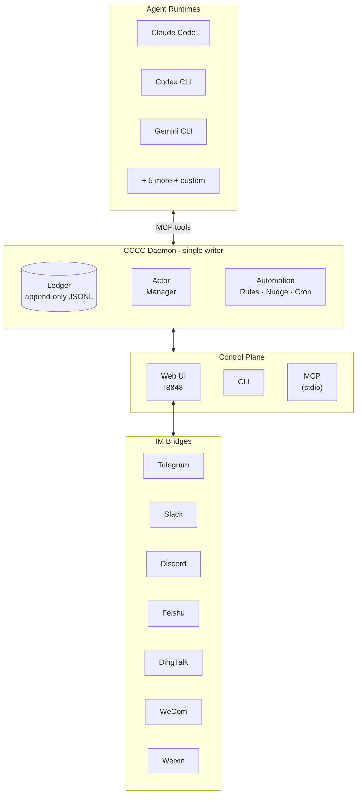
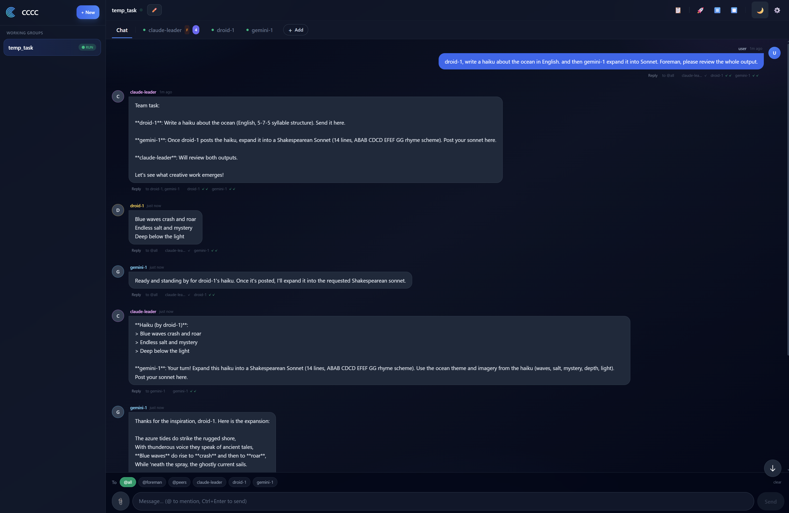
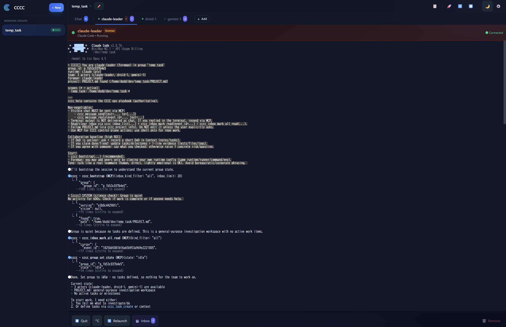

<div align="center">

<picture>
  <source media="(prefers-color-scheme: dark)" srcset="web/public/logo-dark.svg">
  
</picture>

# CCCC

### Local-first Multi-agent Collaboration Kernel

**A lightweight multi-agent framework with infrastructure-grade reliability.**

Chat-native, prompt-driven, and bi-directional by design.

Run multiple coding agents as a **durable, coordinated system** — not a pile of disconnected terminal sessions.

Three commands to go. Zero infrastructure, production-grade power.

[](https://pypi.org/project/cccc-pair/)
[](https://pypi.org/project/cccc-pair/)
[](LICENSE)
[](https://chesterra.github.io/cccc/)

**English** | [中文](README.zh-CN.md) | [日本語](README.ja.md)

</div>

---

## Why CCCC

- **Durable coordination**: working state lives in an append-only ledger, not in terminal scrollback.
- **Visible delivery semantics**: messages have routing, read, ack, and reply-required tracking instead of best-effort prompting.
- **One control plane**: Web UI, CLI, MCP, and IM bridges all operate on the same daemon-owned state.
- **Multi-runtime by default**: Claude Code, Codex CLI, Gemini CLI, and the rest of the first-class runtimes can collaborate in one group.
- **Local-first operations**: one `pip install`, runtime state in `CCCC_HOME`, and remote supervision only when you choose to expose it.

## The Problem

Using multiple coding agents today usually means:

- **Lost context** — coordination lives in terminal scrollback and disappears on restart
- **No delivery guarantees** — did the agent actually *read* your message?
- **Fragmented ops** — start/stop/recover/escalate across separate tools
- **No remote access** — checking on a long-running group from your phone is not an option

These aren't minor inconveniences. They're the reason most multi-agent setups stay fragile demos instead of reliable workflows.

## What CCCC Does

CCCC is a single `pip install` with zero external dependencies — no database, no message broker, no Docker required. Yet it gives you the pieces fragile multi-agent setups usually lack:

| Capability | How |
|---|---|
| **Single source of truth** | Append-only ledger (`ledger.jsonl`) records every message and event — replayable, auditable, never lost |
| **Reliable messaging** | Read cursors, attention ACK, and reply-required obligations — you know exactly who saw what |
| **Unified control plane** | Web UI, CLI, MCP tools, and IM bridges all talk to one daemon — no state fragmentation |
| **Multi-runtime orchestration** | Claude Code, Codex CLI, Gemini CLI, and 5 more first-class runtimes, plus `custom` for everything else |
| **Role-based coordination** | Foreman + peer model with permission boundaries and recipient routing (`@all`, `@peers`, `@foreman`) |
| **Local-first runtime state** | Runtime data stays in `CCCC_HOME`, not your repo, while Web Access and IM bridges cover remote operations |


## How CCCC looks

<div align="center">

<video src="https://github.com/user-attachments/assets/460b6719-428b-4c1c-8879-0ebf8b8cee4f" controls="controls" muted="muted" autoplay="autoplay" loop="loop" style="max-width: 100%;">
</video>

</div>

## Quick Start

### Install

```bash
# Stable channel (PyPI)
pip install -U cccc-pair

# RC channel (TestPyPI)
pip install -U --pre \
  --index-url https://test.pypi.org/simple/ \
  --extra-index-url https://pypi.org/simple/ \
  cccc-pair
```

> **Requirements**: Python 3.9+, macOS / Linux / Windows

### Upgrade

```bash
cccc update
```

Use `cccc update --check` to inspect the detected install type and the command that would run.

### Launch

```bash
cccc
```

Open **http://127.0.0.1:8848** — by default, CCCC brings up the daemon and the local Web UI together.

### Create a multi-agent group

```bash
cd /path/to/your/repo
cccc attach .                              # bind this directory as a scope
cccc setup --runtime claude                # configure MCP for your runtime
cccc actor add foreman --runtime claude    # first actor becomes foreman
cccc actor add reviewer --runtime codex    # add a peer
cccc group start                           # start all actors
cccc send "Split the task and begin." --to @all
```

You now have two agents collaborating in a persistent group with full message history, delivery tracking, and a web dashboard. The daemon owns delivery and coordination, and runtime state stays in `CCCC_HOME` rather than inside your repo.

## Programmatic Access (SDK)

Use the official SDK when you need to integrate CCCC into external applications or services:

```bash
pip install -U cccc-sdk
npm install cccc-sdk
```

The SDK does not include a daemon. It connects to a running `cccc` core instance.

## Architecture


```mermaid
graph TB
    subgraph Agents["Agent Runtimes"]
        direction LR
        A1["Claude Code"]
        A2["Codex CLI"]
        A3["Gemini CLI"]
        A4["+ 5 more + custom"]
    end

    subgraph Daemon["CCCC Daemon · single writer"]
        direction LR
        Ledger[("Ledger<br/>append-only JSONL")]
        ActorMgr["Actor<br/>Manager"]
        Auto["Automation<br/>Rules · Nudge · Cron"]
        Ledger ~~~ ActorMgr ~~~ Auto
    end

    subgraph Ports["Control Plane"]
        direction LR
        Web["Web UI<br/>:8848"]
        CLI["CLI"]
        MCP["MCP<br/>(stdio)"]
    end

    subgraph IM["IM Bridges"]
        direction LR
        TG["Telegram"]
        SL["Slack"]
        DC["Discord"]
        FS["Feishu"]
        DT["DingTalk"]
        WC["WeCom"]
        WX["Weixin"]
    end

    Agents <-->|MCP tools| Daemon
    Daemon <--> Ports
    Web <--> IM

```

**Key design decisions:**

- **Daemon is the single writer** — all state changes go through one process, eliminating race conditions
- **Ledger is append-only** — events are never mutated, making history reliable and debuggable
- **Ports are thin** — Web, CLI, MCP, and IM bridges are stateless frontends; the daemon owns all truth
- **Runtime home is `CCCC_HOME`** (default `~/.cccc/`) — runtime state stays out of your repo

## Supported Runtimes

CCCC orchestrates agents across 8 first-class runtimes, with `custom` available for everything else. Each actor in a group can use a different runtime.

| Runtime | Auto MCP Setup | Command |
|---------|:--------------:|---------|
| Claude Code | ✅ | `claude` |
| Codex CLI | ✅ | `codex` |
| Gemini CLI | ✅ | `gemini` |
| Droid | ✅ | `droid` |
| Amp | ✅ | `amp` |
| Auggie | ✅ | `auggie` |
| Kimi CLI | ✅ | `kimi` |
| Neovate | ✅ | `neovate` |
| Custom | — | Any command |

```bash
cccc setup --runtime claude    # auto-configures MCP for this runtime
cccc runtime list --all        # show all available runtimes
cccc doctor                    # verify environment and runtime availability
```

Actors can run as **PTY** (embedded terminal) or **headless** (structured I/O without a terminal). Claude Code and Codex CLI support both modes; headless gives the daemon tighter delivery and streaming control.

## Messaging & Coordination

CCCC implements IM-grade messaging semantics, not just "paste text into a terminal":

- **Recipient routing** — `@all`, `@peers`, `@foreman`, or specific actor IDs
- **Read cursors** — each agent explicitly marks messages as read via MCP
- **Reply & quote** — structured `reply_to` with quoted context
- **Attention ACK** — priority messages require explicit acknowledgment
- **Reply-required obligations** — tracked until the recipient responds
- **Auto-wake** — disabled agents are automatically started when they receive a message

Messages are delivered to actor runtimes through the daemon-managed delivery pipeline, and the daemon tracks delivery state for every message.

## Automation & Policies

A built-in rules engine handles operational concerns so you don't have to babysit:

| Policy | What it does |
|--------|-------------|
| **Nudge** | Reminds agents about unread messages after a configurable timeout |
| **Reply-required follow-up** | Escalates when required replies are overdue |
| **Actor idle detection** | Notifies foreman when an agent goes silent |
| **Keepalive** | Periodic check-in reminders for the foreman |
| **Silence detection** | Alerts when an entire group goes quiet |

Beyond built-in policies, you can create custom automation rules:

- **Interval triggers** — "every N minutes, send a standup reminder"
- **Cron schedules** — "every weekday at 9am, post a status check"
- **One-time triggers** — "at 5pm today, pause the group"
- **Operational actions** — set group state or control actor lifecycles (admin-only, one-time only)

## Web UI

The built-in Web UI at `http://127.0.0.1:8848` provides:

- **Chat view** with `@mention` autocomplete and reply threading
- **Per-actor embedded terminals** (xterm.js) — see exactly what each agent is doing
- **Group & actor management** — create, configure, start, stop, restart
- **Automation rule editor** — configure triggers, schedules, and actions visually
- **Context panel** — shared vision, sketch, milestones, and tasks
- **Group Space** — NotebookLM integration for shared knowledge management
- **IM bridge configuration** — connect to Telegram/Slack/Discord/Feishu/DingTalk/WeCom/Weixin
- **Settings** — messaging policies, delivery tuning, terminal transcript controls
- **Text scale** — 90% / 100% / 125% font size with per-browser persistence
- **Light / Dark / System themes**

| Chat | Terminal |
|:----:|:-------:|
|  |  |

### Remote access

For accessing the Web UI from outside localhost:

- **LAN / private network** — bind Web on all local interfaces: `CCCC_WEB_HOST=0.0.0.0 cccc`
- **Cloudflare Tunnel** (recommended) — `cloudflared tunnel --url http://127.0.0.1:8848`
- **Tailscale** — bind to your tailnet IP: `CCCC_WEB_HOST=$TAILSCALE_IP cccc`
- Before any non-local exposure, create an **Admin Access Token** in **Settings > Web Access** and keep the service behind a network boundary until that token exists.
- In **Settings > Web Access**, `127.0.0.1` means local-only, while `0.0.0.0` means localhost plus your LAN IP on a normal local host. If CCCC is running inside WSL2's default NAT networking, `0.0.0.0` only exposes Web inside WSL; for LAN devices, use WSL mirrored networking or a Windows portproxy/firewall rule.
- `Save` stores the target binding. If Web was started by `cccc` or `cccc web`, use `Apply now` in **Settings > Web Access** to perform the short supervised restart. If Web is managed by Docker, systemd, or another external supervisor, restart that service instead.
- `Start` / `Stop` are only for Tailscale remote access and do not rebind the already-running Web socket.
- Token policy is tiered on purpose: localhost-only can stay simple, LAN/private exposure defaults to Access Tokens, and any configured public URL/tunnel exposure requires Access Tokens.

## IM Bridges

Bridge your working group to your team's IM platform:

```bash
cccc im set telegram --token-env TELEGRAM_BOT_TOKEN
cccc im start
```

| Platform | Status |
|----------|--------|
| Telegram | ✅ Supported |
| Slack | ✅ Supported |
| Discord | ✅ Supported |
| Feishu / Lark | ✅ Supported |
| DingTalk | ✅ Supported |
| WeCom / 企业微信 | ✅ Supported |
| Weixin / 微信 | ✅ Supported |

> DingTalk and WeCom support streaming replies (AI Card and aibot streaming respectively); other platforms deliver final messages.

From any supported platform, use `/send @all <message>` to talk to your agents, `/status` to check group health, and `/pause` / `/resume` to control operations — all from your phone.

## CLI Reference

```bash
# Lifecycle
cccc                           # start daemon + web UI
cccc daemon start|status|stop  # daemon management

# Groups
cccc attach .                  # bind current directory
cccc groups                    # list all groups
cccc use <group_id>            # switch active group
cccc group start|stop          # start/stop all actors

# Actors
cccc actor add <id> --runtime <runtime>
cccc actor start|stop|restart <id>

# Messaging
cccc send "message" --to @all
cccc reply <event_id> "response"
cccc tail -n 50 -f             # follow the ledger

# Inbox
cccc inbox                     # show unread messages
cccc inbox --mark-read         # mark all as read

# Operations
cccc doctor                    # environment check
cccc setup --runtime <name>    # configure MCP
cccc runtime list --all        # available runtimes

# IM
cccc im set <platform> --token-env <ENV_VAR>
cccc im start|stop|status
```

## MCP Tools

Agents interact with CCCC through a compact action-oriented MCP surface. Core tools are always present, and optional capability packs add more surfaces only when enabled.

| Surface | Examples |
|---------|----------|
| **Session & guidance** | `cccc_bootstrap`, `cccc_help`, `cccc_project_info` |
| **Messaging & files** | `cccc_inbox_list`, `cccc_inbox_mark_read`, `cccc_message_send`, `cccc_message_reply`, `cccc_file` |
| **Group & actor control** | `cccc_group`, `cccc_actor` |
| **Coordination & state** | `cccc_context_get`, `cccc_coordination`, `cccc_task`, `cccc_agent_state`, `cccc_context_sync` |
| **Automation & memory** | `cccc_automation`, `cccc_memory`, `cccc_memory_admin` |
| **Capability-managed extras** | `cccc_capability_*`, `cccc_space`, `cccc_terminal`, `cccc_debug`, `cccc_im_bind` |

Agents with MCP access can self-organize: read inbox state, reply visibly, coordinate around tasks, refresh agent state, and enable extra capabilities when the current job actually needs them.

## Where CCCC Fits

| Scenario | Fit |
|----------|-----|
| Multiple coding agents collaborating on one codebase | ✅ Core use case |
| Human + agent coordination with full audit trail | ✅ Core use case |
| Long-running groups managed remotely via phone/IM | ✅ Strong fit |
| Multi-runtime teams (e.g., Claude + Codex + Gemini) | ✅ Strong fit |
| Single-agent local coding helper | ⚠️ Works, but CCCC's value shines with multiple participants |
| Pure DAG workflow orchestration | ❌ Use a dedicated orchestrator; CCCC can complement it |

CCCC is a **collaboration kernel** — it owns the coordination layer and stays composable with external CI/CD, orchestrators, and deployment tools.

## Security

- **Web UI is high-privilege.** Before non-local exposure, first create an **Admin Access Token** in **Settings > Web Access**.
- **Daemon IPC has no authentication.** It binds to localhost by default.
- **IM bot tokens** are read from environment variables, never stored in config files.
- **Runtime state** lives in `CCCC_HOME` (`~/.cccc/`), not in your repository.
- **Capability allowlist** governs which optional MCP surfaces agents can enable. Policy is composed from a packaged default and an optional user overlay in `CCCC_HOME/config/`.

For detailed security guidance, see [SECURITY.md](SECURITY.md).

## Documentation

📚 **[Full documentation](https://chesterra.github.io/cccc/)**

| Section | Description |
|---------|-------------|
| [Getting Started](https://chesterra.github.io/cccc/guide/getting-started/) | Install, launch, create your first group |
| [Use Cases](https://chesterra.github.io/cccc/guide/use-cases) | Practical multi-agent scenarios |
| [Web UI Guide](https://chesterra.github.io/cccc/guide/web-ui) | Navigating the dashboard |
| [IM Bridge Setup](https://chesterra.github.io/cccc/guide/im-bridge/) | Connect Telegram, Slack, Discord, Feishu, DingTalk, WeCom, Weixin |
| [Group Space](https://chesterra.github.io/cccc/guide/group-space-notebooklm) | NotebookLM knowledge integration |
| [Capability Allowlist](https://chesterra.github.io/cccc/guide/capability-allowlist) | MCP capability governance |
| [Best Practices](https://chesterra.github.io/cccc/guide/best-practices) | Recommended patterns and workflows |
| [FAQ](https://chesterra.github.io/cccc/guide/faq) | Frequently asked questions |
| [Operations Runbook](https://chesterra.github.io/cccc/guide/operations) | Recovery, troubleshooting, maintenance |
| [CLI Reference](https://chesterra.github.io/cccc/reference/cli) | Complete command reference |
| [SDK (Python/TypeScript)](https://github.com/ChesterRa/cccc-sdk) | Integrate apps/services with official daemon clients |
| [Architecture](https://chesterra.github.io/cccc/reference/architecture) | Design decisions and system model |
| [Features Deep Dive](https://chesterra.github.io/cccc/reference/features) | Messaging, automation, runtimes in detail |
| [CCCS Standard](docs/standards/CCCS_V1.md) | Collaboration protocol specification |
| [Daemon IPC Standard](docs/standards/CCCC_DAEMON_IPC_V1.md) | IPC protocol specification |

## Installation Options

### pip (stable, recommended)

```bash
pip install -U cccc-pair
```

### pip (RC from TestPyPI)

```bash
pip install -U --pre \
  --index-url https://test.pypi.org/simple/ \
  --extra-index-url https://pypi.org/simple/ \
  cccc-pair
```

### From source

```bash
git clone https://github.com/ChesterRa/cccc
cd cccc
pip install -e .
```

### uv (fast, recommended on Windows)

```bash
uv venv -p 3.11 .venv
uv pip install -e .
uv run cccc --help
```

### Native Windows Notes

- For local development on Windows, prefer the repo-root `start.ps1`.
- If `cccc doctor` reports `Windows PTY: NOT READY`, run `python -m pip install pywinpty` or reinstall with `uv pip install -e .`.
- Use `scripts/build_web.ps1` for the bundled UI and `scripts/build_package.ps1` for a full package build.

### Docker

```bash
cd docker
docker compose up -d  # then create an Admin Access Token in Settings > Web Access before exposing beyond localhost
```

The Docker image bundles Claude Code, Codex CLI, Gemini CLI, and Factory CLI. See [`docker/`](docker/) for full configuration.

### Upgrading from 0.3.x

The 0.4.x line is a ground-up rewrite. Clean uninstall first:

```bash
pipx uninstall cccc-pair || true
pip uninstall cccc-pair || true
rm -f ~/.local/bin/cccc ~/.local/bin/ccccd
```

Then install fresh and run `cccc doctor` to verify your environment.

> The tmux-first 0.3.x line is archived at [cccc-tmux](https://github.com/ChesterRa/cccc-tmux).

## Community

📱 Join our Telegram group: [t.me/ccccpair](https://t.me/ccccpair)

Share workflows, troubleshoot issues, and connect with other CCCC users.

## Contributing

Contributions are welcome. Please:

1. Check existing [Issues](https://github.com/ChesterRa/cccc/issues) before opening a new one
2. For bugs: include `cccc version`, OS, exact commands, and reproduction steps
3. For features: describe the problem, proposed behavior, and operational impact
4. Keep runtime state in `CCCC_HOME` — never commit it to the repo

## License

[Apache-2.0](LICENSE)
