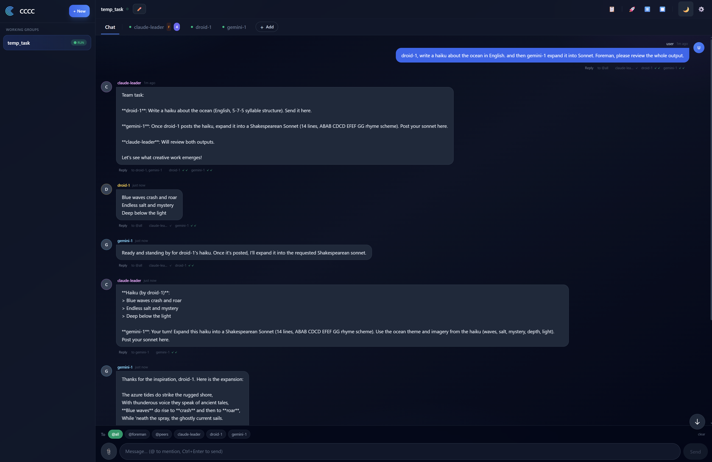
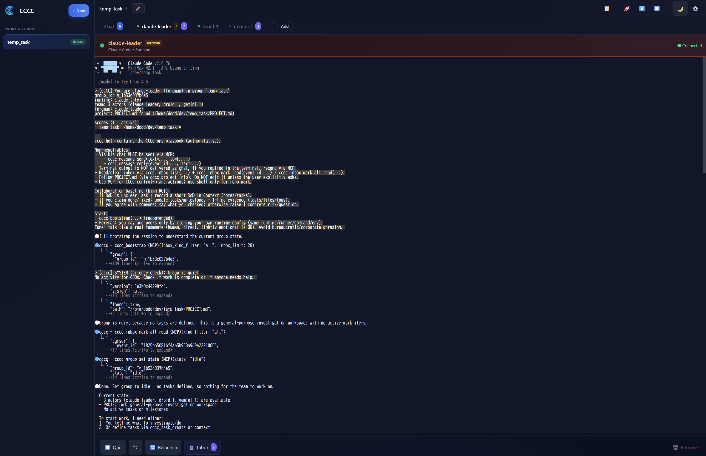

# CCCC 0.4.x（RC）— 全局多智能体交付内核

[English](README.md) | **中文** | [日本語](README.ja.md)

> 状态：**0.4.0rc11**（Release Candidate）。为了保证正确性与一致性，0.4.x 期间仍可能有破坏性变更。

CCCC 是一个**本地优先（local-first）的多智能体协作内核**：它的交互体验尽量接近成熟 IM，但在可靠性上依托于：

- 单一写入者 daemon（唯一事实源）
- 每个工作组一份追加式 ledger（持久历史）
- 面向 agents 的 MCP 工具面（避免“stdout 打字但没人看到”的歧义）

一眼看懂：

- 单一 daemon（`ccccd`）统一协调多个 agent runtime（Claude Code、Codex CLI、Droid、OpenCode、Copilot 等）
- 每个 working group 都有一份**追加式 ledger**，作为唯一事实源
- **内置 Web UI** 作为控制平面（响应式布局，移动端优先）
- **内嵌 MCP stdio server**，让 agents 通过工具执行 CCCC 操作与发消息（避免“stdout 打字但没人看到”的不确定性）

旧版 tmux/TUI（v0.3.x）仓库： https://github.com/ChesterRa/cccc-tmux

---

## 截图

Chat 界面：



Agent terminal 界面：



## 为什么要从 v0.3 重写？

v0.3.x（tmux-first）验证了“多 agent + 编排循环”是可行的，但也暴露了真实的产品瓶颈：

1) **没有统一 ledger**  
   消息分散在多个文件中管理。每次投递后 agent 往往需要再去读消息文件/拉完整内容才能继续推进，效率和体验都受影响。

2) **agent 数量受限**  
   tmux 版的布局与运维方式天然倾向于 1–2 个 agent，扩展到更多 agents 会非常别扭。

3) **缺少完整的“让 agent 也能控制系统”的工具面**  
   旧版没有一整套统一工具让 agent 像用户一样去管理 working group / actors / 设置等，因此很难发挥 agent 的自主规划与自主管理能力。

4) **远程访问不是一等体验**  
   tmux 适合本地终端，但对于“手机/异地随时打开继续用”，缺少天然的载体。Web 控制台才是更合适的基础设施。

0.4.x 重写的核心是把边界收紧：

- **统一 ledger**：每个 group 一份追加式账本，作为唯一事实源。
- **N-actor 模型**：一个 group 可以容纳多个 actors；add/start/stop/relaunch 都是一等操作。
- **MCP 控制平面**：agent 可通过工具管理与操作 CCCC（消息、context、actors、group state 等）。
- **Web-first 控制台**：基于成熟 Web 技术栈；配合 Cloudflare/Tailscale/WireGuard 等即可实现高质量远程访问体验。
- **IM 级交互体验**：借鉴成熟 IM 的交互设计，让 user↔agent 的沟通像聊天软件一样简单——@mentions 精准投递、reply/quote、显式已读/确认，并在 Web/IM 两端保持一致。
- **一个运行时目录**：`CCCC_HOME`（默认 `~/.cccc/`）统一承载 groups/ledger/runtime state。
- **一个写入者**：daemon 是 ledger 的唯一写入者；ports 保持薄层。

坦诚的取舍：

- 0.4.x 是 daemon-based（一个长驻的本地服务）。
- 0.4.x 是 RC，我们优先做“正确性 + UX 一致性”，而不是堆功能。
- 如果你更喜欢旧版 tmux 工作流，请使用 `cccc-tmux`（v0.3.x）。

---

## 核心概念

- **Working Group（工作组）**：协作单位（类似群聊）+ 持久历史 + 自动化。
- **Actor**：一个 agent 会话（PTY 或 headless）。
- **Scope**：绑定到 group 的目录 URL；每个事件都有 `scope_key` 归属。
- **Ledger**：追加式事件流；消息与状态变更都是一等事件。
- **`CCCC_HOME`**：全局运行时目录（默认 `~/.cccc/`）。

默认目录结构：

```text
~/.cccc/
  daemon/
    ccccd.sock
    ccccd.log
  groups/<group_id>/
    group.yaml
    ledger.jsonl
    context/
    state/
```

---

## 运行要求

- Python 3.9+
- macOS / Linux（Windows 建议使用 WSL）
- 至少安装一个支持的 agent CLI（Claude/Codex/Droid/OpenCode/Copilot 等）
- Node.js 仅用于 **Web UI 开发**（普通用户无需 Node，UI 已内置打包）

---

## 安装

### 从 TestPyPI 安装 0.4.x RC（当前推荐）

RC tag（例如 `v0.4.0-rc11`）会发布到 **TestPyPI**。建议依赖从 PyPI 安装，仅 RC 包从 TestPyPI 获取：

```bash
python -m pip install --index-url https://pypi.org/simple \
  --extra-index-url https://test.pypi.org/simple \
  cccc-pair==0.4.0rc11
```

说明：目前 PyPI 上的最新稳定版仍是旧版 v0.3.x。想体验 0.4.x RC 请使用以上命令。

### 从源码安装（开发态）

```bash
git clone https://github.com/ChesterRa/cccc
cd cccc
pip install -e .
```

Web UI 开发（可选）：

```bash
cd web
npm install
npm run dev
```

---

## 快速开始（本地）

```bash
# 1) 进入你的 repo（scope）
cd /path/to/repo

# 2) 创建/绑定工作组
cccc attach .

# 3) 为 runtime 配置 MCP（强烈推荐）
cccc setup --runtime claude   # 或 codex / droid / opencode / copilot / ...

# 4) 添加 actors（第一个启用的 actor 自动成为 foreman）
cccc actor add foreman --runtime claude
cccc actor add peer-1  --runtime codex

# 5) 启动 group（会拉起所有 enabled actors）
cccc group start

# 6) 启动 daemon + Web 控制台（Ctrl+C 同时停止）
cccc
```

打开 `http://127.0.0.1:8848/`（会跳转到 `/ui/`）。

---

## Runtimes 与 MCP 配置

CCCC 不绑定厂商，但各 CLI 的 MCP 配置方式不同：

- 自动安装 MCP：`claude`、`codex`、`droid`、`amp`、`auggie`、`neovate`、`gemini`
- 手动安装 MCP（CCCC 直接输出配置说明）：`cursor`、`kilocode`、`opencode`、`copilot`、`custom`

常用命令：

```bash
cccc runtime list --all
cccc setup --runtime <name>
```

建议的默认启动命令（按需可为每个 actor 单独覆盖）：

- Claude Code：`claude --dangerously-skip-permissions`
- Codex CLI：`codex --dangerously-bypass-approvals-and-sandbox --search`
- Copilot CLI：`copilot --allow-all-tools --allow-all-paths`

---

## Web UI（移动端优先）

内置 Web UI 是主要控制平面：

- 多 group 导航
- Actor 管理（add/start/stop/relaunch）
- Chat（@mentions + reply）
- 每个 actor 的内嵌终端（PTY runner）
- Context + Automation settings
- IM Bridge 配置
- PROJECT.md 查看/编辑（repo root）

---

## PROJECT.md（项目宪法）

在 scope 根目录（repo root）放置 `PROJECT.md`，并将其视为项目宪法：

- Agent 应尽早阅读（MCP 工具：`cccc_project_info`）。
- Web UI 支持查看/编辑/创建，但 agent **不应**在未获用户明确要求时修改 PROJECT.md。

---

## IM Bridge（Telegram / Slack / Discord）

CCCC 支持把 working group 桥接到 IM 平台：

- 订阅是显式的（例如在群里发送 `/subscribe`）。
- 附件落在 `CCCC_HOME` 的 blobs，并以引用方式进入 ledger（默认不写入 repo）。

可通过 Web UI（Settings → IM Bridge）或 CLI 配置：

```bash
cccc im set telegram --token-env TELEGRAM_BOT_TOKEN
cccc im start
```

---

## 安全提示（远程/手机访问）

Web UI 权限很高（可以控制 actors、访问项目文件）。如果要远程暴露：

- 设置 `CCCC_WEB_TOKEN`，并放在访问网关后（Cloudflare Access / Tailscale / WireGuard 等）。
- 不要把未鉴权的本地端口直接暴露到公网。

---

## CLI 速查

```bash
cccc doctor
cccc runtime list --all
cccc groups
cccc use <group_id>

cccc send "hello" --to @all
cccc reply <event_id> "reply text"
cccc inbox --actor-id <id> --mark-read
cccc tail -n 50 -f

cccc daemon status|start|stop
cccc mcp
```

---

## 文档

- `docs/vnext/README.md`（入口）
- `docs/vnext/ARCHITECTURE.md`
- `docs/vnext/FEATURES.md`
- `docs/vnext/STATUS.md`
- `docs/vnext/RELEASE.md`（维护者）

## License

Apache-2.0
