# CCCC Architecture

This document explains the internal architecture of CCCC Pair orchestrator.

## The Core Contract

CCCC uses a simple, file-based mailbox contract:

- **Peers write** `<TO_USER>` and `<TO_PEER>` messages with a trailing fenced `insight` block
- **Messages include**: who (from), kind (claim/counter/evidence/progress), next step, refs (evidence pointers)
- **Evidence types**: patch diffs, test logs, benchmark results, commit hashes
- **State changes**: Only messages with valid evidence (e.g., `patch.diff`, `test:passed`) affect the codebase

## Repo-Native Anchors (POR/SUBPOR)

Strategy and execution live in your repository under `docs/por/`:

- **`POR.md`** (strategic board): North star, deliverables, roadmap (Now/Next/Later), risk radar, recent decisions
- **`T######-slug/SUBPOR.md`** (per-task sheet): Goal, acceptance criteria, cheapest probe, kill criteria, implementation notes, next step

Peers update these naturally as they work. You can read them anytime to see the big picture.

## Collaboration Architecture

```mermaid
flowchart TB
    subgraph UserLayer["User Layer"]
        User["👤 User<br/>(Vision, RFD)"]
    end

    subgraph OrchestrationLayer["Orchestration Layer"]
        Foreman["⏰ Foreman<br/>(scheduled)"]
        Aux["🔧 Aux<br/>(on-demand)"]

        subgraph Peers["Peer Collaboration"]
            PeerA["🤖 PeerA"]
            PeerB["🤖 PeerB"]
            PeerA <--> |"mailbox"| PeerB
        end
    end

    subgraph ArtifactLayer["Artifact Layer (Persistent State)"]
        Codebase["📁 Codebase<br/>(patches)"]
        Ledger["📋 Ledger<br/>(audit)"]
        POR["📊 POR/<br/>SUBPOR"]
    end

    User -->|"direct command"| Peers
    User -.->|"delegates"| Foreman
    Foreman -.->|"periodic check"| Peers
    Aux <-.->|"invoke/return"| Peers

    Peers --> Codebase
    Peers --> Ledger
    Peers --> POR
```



**Diagram notes:**
- Solid lines = direct interaction
- Dashed lines = optional/periodic interaction
- User can command peers directly or delegate to Foreman for scheduled tasks

## Key Relationships

- **User → Peers**: Direct commands or delegated through Foreman (scheduled)
- **Peers ⇄ Aux**: Invoke strategic (POR review) or tactical (tests, bulk work) help as needed
- **Peers → Artifacts**: Generate evidence (patches, tests, logs) directly or via Aux
- **Foreman**: Optional user proxy for periodic health checks and task scheduling
- **Aux**: Optional on-demand helper, invoked by peers for strategic or tactical work

## Workflow

1. **User sends a goal** via TUI or IM (e.g., "Add OAuth support")
2. **PeerA frames intent** (CLAIM) with acceptance criteria and constraints
3. **PeerB counters** with a sharper path or safer rollout
4. **Peers iterate** until consensus, then implement with small patches (≤150 lines)
5. **Evidence gates progress**: Only tested patches, stable logs, and commits count as "done"
6. **Orchestrator logs outcomes** to ledger; status panel updates in real-time

## Folder Layout

```
.cccc/
  adapters/bridge_*.py            # Chat bridges (optional: Telegram/Slack/Discord)
  orchestrator/                    # Core orchestrator modules
    handoff.py                     # Handoff delivery + self-check
    auto_compact.py                # Auto-compact logic
    keepalive.py                   # Keepalive nudge system
    foreman_scheduler.py           # Foreman scheduling
    ...
  settings/                        # Configuration files (no manual edit needed)
    cli_profiles.yaml              # Actor bindings, delivery config
    agents.yaml                    # CLI actor definitions
    policies.yaml                  # Strategic policies
    telegram.yaml / slack.yaml     # IM bridge configs
    foreman.yaml                   # Foreman config
  mailbox/                         # Message exchange (to_user.md, to_peer.md, inbox/, processed/)
  state/                           # Runtime state (ephemeral, gitignored)
    ledger.jsonl                   # Event log with auto-compact diagnostics
    orchestrator.log               # Runtime logs
    status.json                    # Current orchestrator state
  logs/                            # Peer CLI logs (ephemeral)
  work/                            # Shared workspace (gitignored)
  tui_ptk/app.py                   # TUI implementation
  orchestrator_tmux.py             # Main orchestrator runtime
  prompt_weaver.py                 # System prompt builder
  ...

docs/
  por/
    POR.md                         # Strategic board (North star, roadmap, decisions)
    T000123-your-task/SUBPOR.md    # Per-task sheet (goal/acceptance/probe/next)

PROJECT.md                         # Your project brief (woven into system prompts)
FOREMAN_TASK.md                    # Foreman task brief (if using Foreman)
```

## Configuration Files

All in `.cccc/settings/`:

- **`cli_profiles.yaml`** — Actor bindings, roles, delivery settings (mailbox, nudge, keepalive, auto-compact)
- **`agents.yaml`** — CLI actor definitions and capabilities (compact support, commands, IO profiles)
- **`policies.yaml`** — Strategic policies (autonomy level, handoff filters)
- **`telegram.yaml`** — Telegram bridge config (token, allowlist, routing)
- **`slack.yaml`** — Slack bridge config (similar structure)
- **`discord.yaml`** — Discord bridge config (similar structure)
- **`foreman.yaml`** — Foreman agent and cadence

**No manual editing required** — TUI Setup Panel handles all common changes. Advanced users can tweak YAML directly for fine-grained control.

## Environment Variables

Optional overrides:

- `CLAUDE_I_CMD` — Override default `claude` command (e.g., `claude-dev`)
- `CODEX_I_CMD` — Override default `codex` command
- `GEMINI_I_CMD` — Override default `gemini` command
- `CCCC_HOME` — Override default `.cccc` directory path
